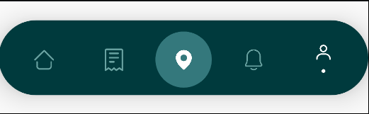
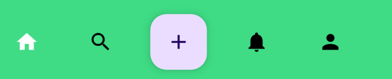
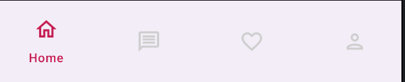
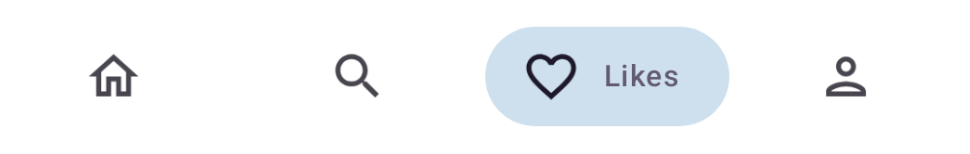

# 🚀 Jetpack Compose Bottom Bars Showcase

This repository demonstrates the use of **Material 3 BottomAppBar** for screen-specific actions and explores a variety of **Bottom Navigation Bars** using **Jetpack Compose**. It also includes advanced **custom bottom bar designs**, navigation handling, and smooth animations for a modern, responsive UI experience.

---

## 📌 Features Covered

### ✅ Material 3 Bottom App Bar
- Implemented `BottomAppBar` from Material 3.
- Used for displaying contextual screen-specific actions.

### ✅ Material 3 Expressive Navigation Bars
- Explored `NavigationBar` and `ShortNavigationBar`.
- Implemented using `NavigationBarItem` and `ShortNavigationBarItem`.
- Styled with rounded shapes, elevation, and custom colors.

### ✅ Bottom Navigation with Compose Navigation
- Used `NavController`, `NavHost`, and custom `Destination` classes.
- Created a navigation graph using Jetpack Compose Navigation component.
- Practiced seamless navigation between multiple destinations using bottom bars.

### ✅ Custom Bottom Bar Designs
- Designed and implemented various custom bottom navigation bars.
- Incorporated unique styles and layouts beyond default Material components.
- One design includes **expandable behavior** using `AnimatedVisibility`.

---

## 🧩 Technologies Used

- Jetpack Compose
- Material 3 & Material 3 Expressive
- Navigation Component (Compose)
- Kotlin
- Android Studio

---

## 📸 Screenshots

Below are sample screenshots of the implemented designs.








## 🎥 Demo Videos

▶️ **Custom Bottom Bar with Animation**


https://github.com/user-attachments/assets/14a6e06f-14de-4145-a600-9ea3bc864603


▶️ **Navigation Bar in Action**


https://github.com/user-attachments/assets/8cf7e631-5d1f-48bf-bb57-58edc106293b

---
Here’s how you can professionally and clearly update your README to include a **full implementation guide** for the bottom bars you showcased in your videos. This section is detailed, structured, and consistent with the rest of your README.

---

## 🛠️ Implementation Guide

This section provides a complete implementation reference for the custom bottom navigation bars showcased in the demo videos. Each design includes either native Jetpack Compose components or third-party libraries with linked documentation.

---

### 🔵 1. **Bullet-Shaped Bottom Bar with Expandable Items**

A custom-designed bottom bar that expands with animated transitions to show additional items. Built entirely using Jetpack Compose with `AnimatedVisibility` for smooth expansion behavior.

📍 **Composable Location**:
`screens/CustomNavigationBars4.kt/BottomNavigationBarSample3

🛠️ **Key Features**:

* Custom bullet-shaped layout.
* Expands using `AnimatedVisibility`.
* Styled using rounded shapes and Material 3 theming.


### 🟣 2. **Animated Bottom Bar with Jumping Dot**

This elegant navigation bar adds a smooth jumping animated dot top of selected tab using the [Exyte Animated Navigation Bar](https://github.com/exyte/AndroidAnimatedNavigationBar) library.

📍 **Composable Location**:
`screens/AnimatedBottomBar2.kt/AnimatedBar2`

📦 **Dependency**:

```kotlin
implementation ("com.exyte:animated-navigation-bar:<latest-version>")
```

📚 **Official Documentation & Setup**:
👉 [Exyte GitHub Repo](https://github.com/exyte/AndroidAnimatedNavigationBar)

🛠️ **Key Features**:

* Built-in support for smooth indicator animations.
* Highly customizable appearance.
* Supports Compose directly with minimal setup.

---

### 🟢 3. **Spring Indicator Bottom Bar**

This bar uses a **spring-like animation** to move the indicator to the selected item using the [Canopas Compose Animated Navigation Bar](https://github.com/canopas/compose-animated-navigationbar) library.

📍 **Composable Location**:
`screens/AnimatedBottomBar1kt/AnimatedBar3`

📦 **Dependency**:

```kotlin
implementation ("com.canopas.compose-animated-navigationbar:bottombar:<latest-version>")
```

📚 **Official Documentation & Setup**:
👉 [Canopas GitHub Repo](https://github.com/canopas/compose-animated-navigationbar)

🛠️ **Key Features**:

* Spring-based smooth animations.
* Fully composable and easy to integrate.
* Offers customization options for color, shape, and behavior.

**💡 Personal Tip**:
 When using this library, you might run into indicator alignment issues — sometimes the indicator appears slightly above or below the expected position relative to the bottom bar item. I faced this myself, and what worked for me was adjusting the width of the item. Try increasing or decreasing the item's width until the indicator aligns properly.

---
## ⭐ Like the Project?

If you found this repository helpful or inspiring, **please give it a star** ⭐. It helps others discover it and motivates further contributions!
